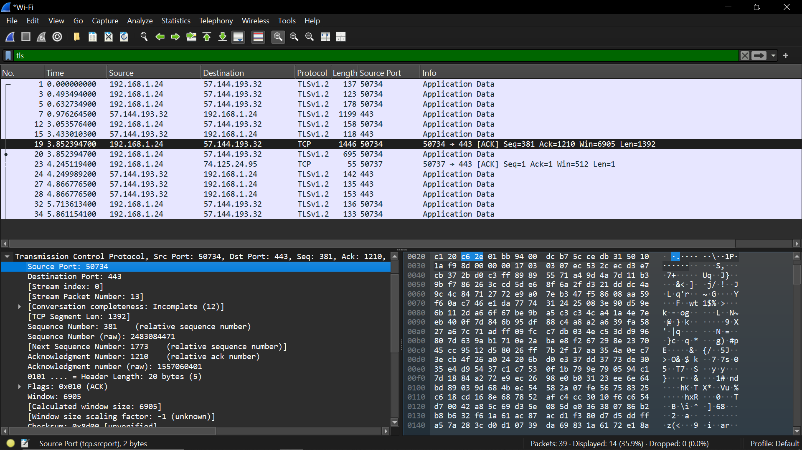
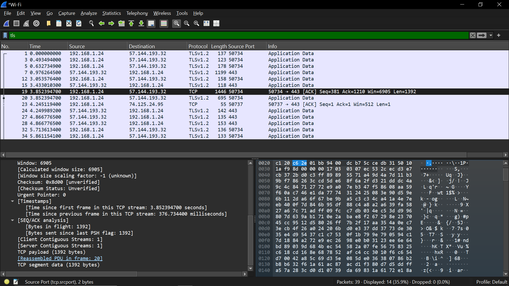
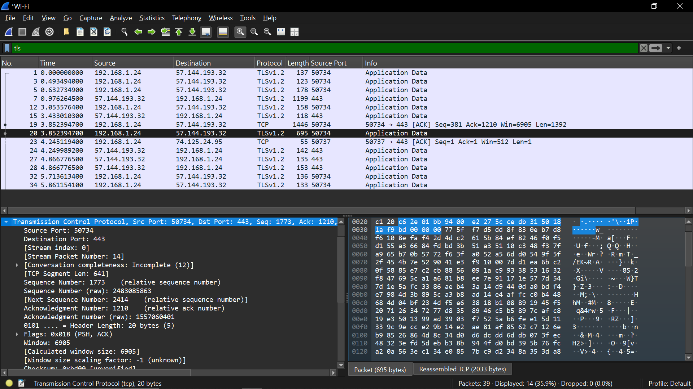
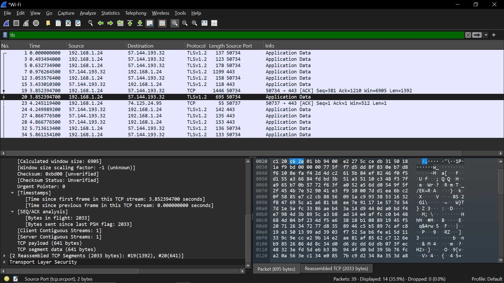
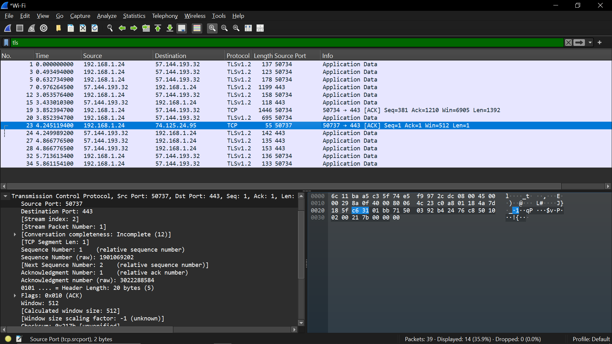
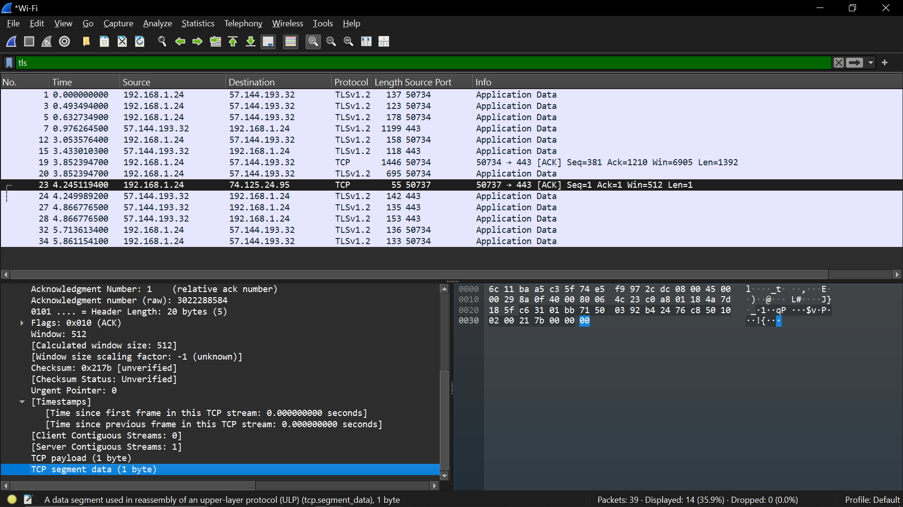

Percobaan Chat

Aktivitas:
buka WhatsApp Web atau Telegram Web
kirim beberapa pesan

Filter:
tls
websocket

Data yang harus dicatat:
TLS traffic

ukuran paket kecil
frekuensi pengiriman

Analisis:
bandingkan dengan streaming

Chat:
paket kecil
frekuensi rendah

Streaming:
paket besar
kontinu