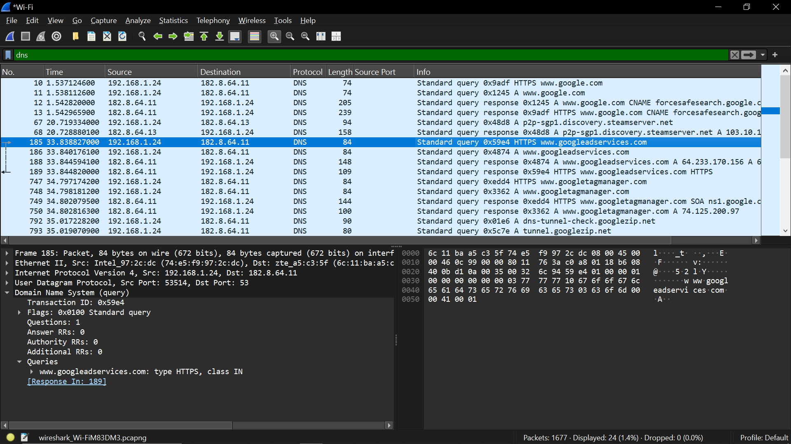
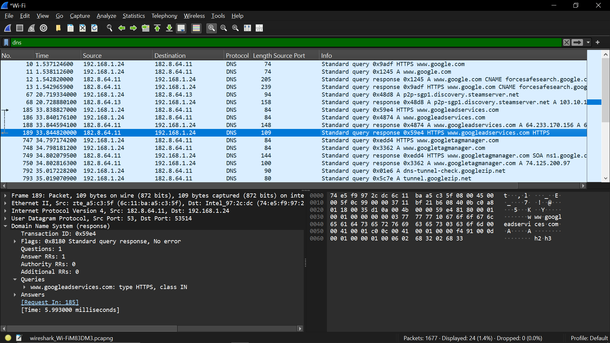

Percobaan DNS

Aktivitas:
Start capture
buka command prompt
jalankan
nslookup google.com
atau buka website baru.

Filter:
dns

Data yang harus ditulis:
Domain query
contoh: google.com

Query type
A record

DNS response IP
contoh: 142.x.x.x
Transaction ID
Response time

Screenshot wajib:
DNS Query

DNS Response

Analisis:
jelaskan mekanisme:

Client → DNS Query
DNS Server → DNS Response

Dan jelaskan fungsi DNS sebagai penerjemah domain ke IP.