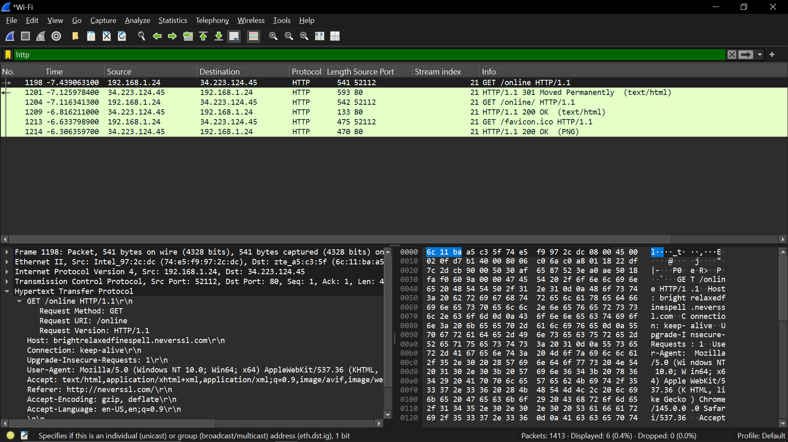
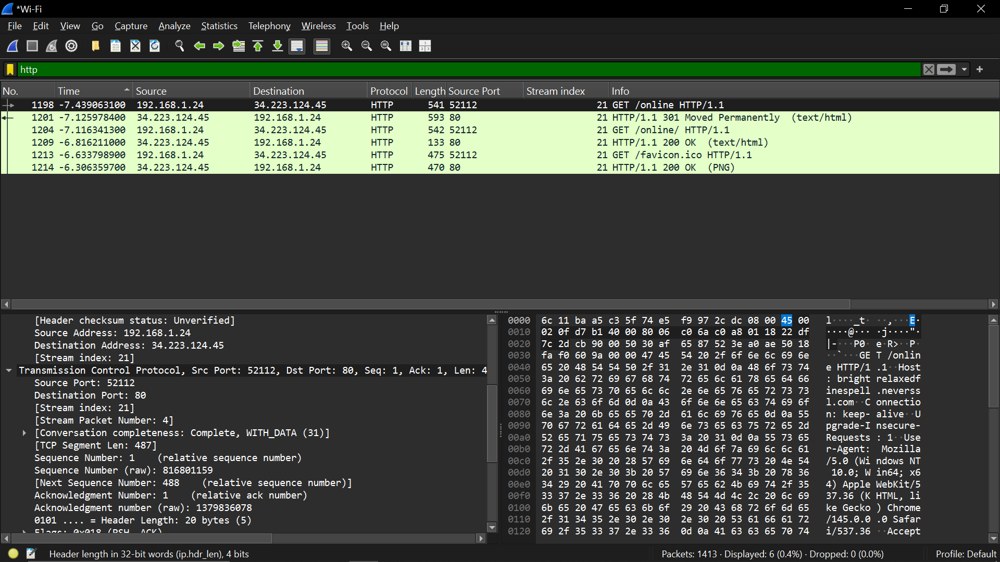

Percobaan HTTP
http://neverssl.com

Data yang harus dicatat:

HTTP Method
contoh: GET
Request URI
Host header

Status code response
contoh: 200 OK
Content type
Source port
Destination port (80)
Packet length

Sequence dan acknowledgement TCP

Bukti screenshot yang harus ada:

HTTP GET request
HTTP response 200 OK
bagian detail header HTTP
Analisis yang harus ditulis:

jelaskan alur berikut

Client → HTTP Request
Server → HTTP Response

Sebutkan bahwa HTTP berjalan di atas TCP port 80 dan data tidak terenkripsi sehingga payload dapat dibaca langsung.

Ini penting untuk perbandingan dengan HTTPS.