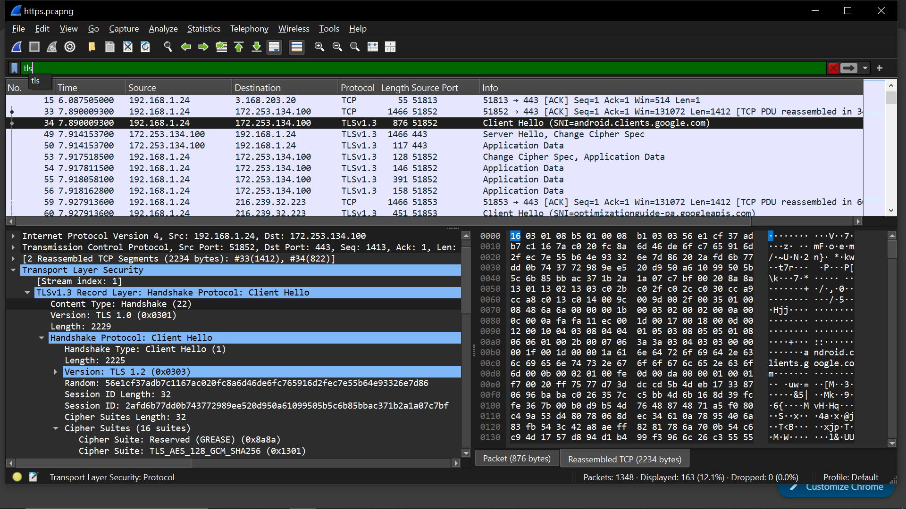
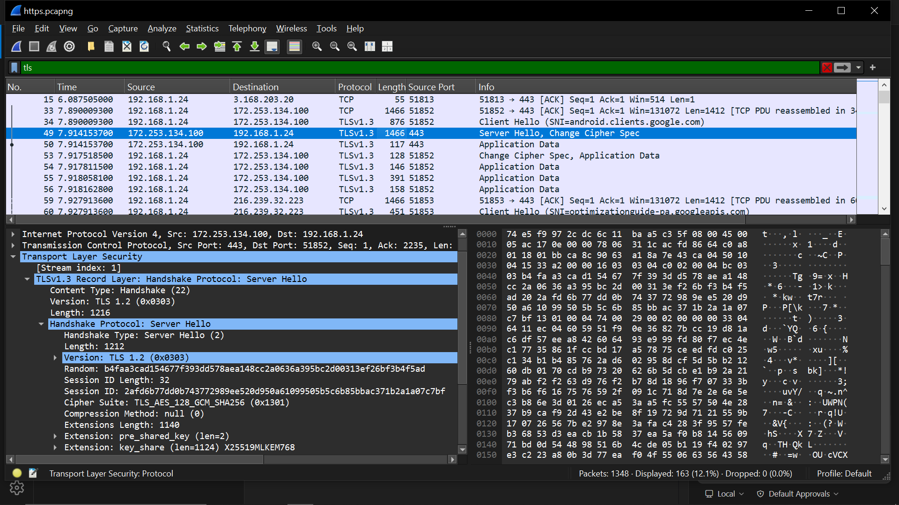
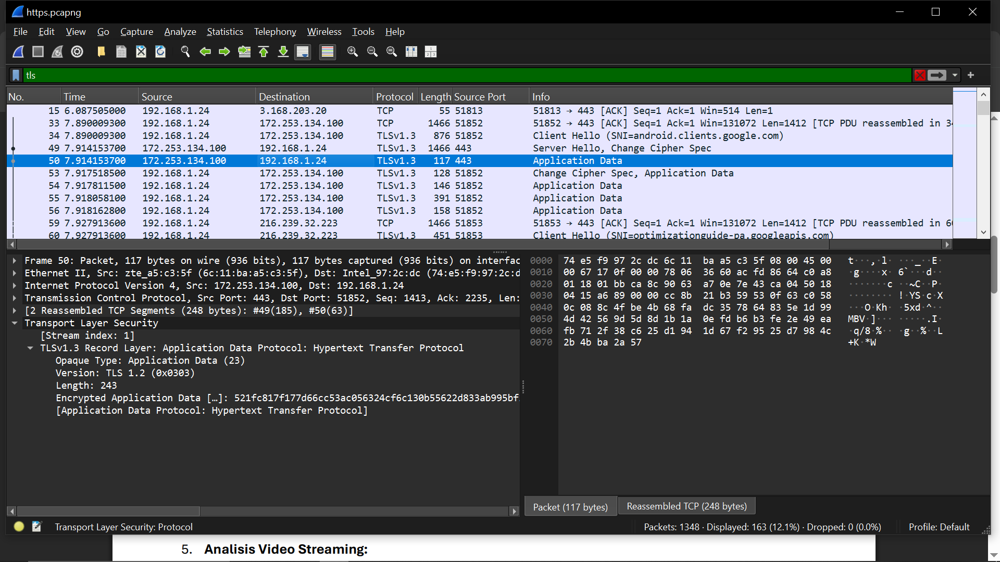

# Percobaan HTTPS

## langkah-langkah
1. jalankan capture
2. buka https://google.com di chrome
3. stop capture
4. filter: tls

## hasil percobaan
1. Baris TLS handshake awal

2. Baris respon server

3. Baris transfer data terenkripsi
