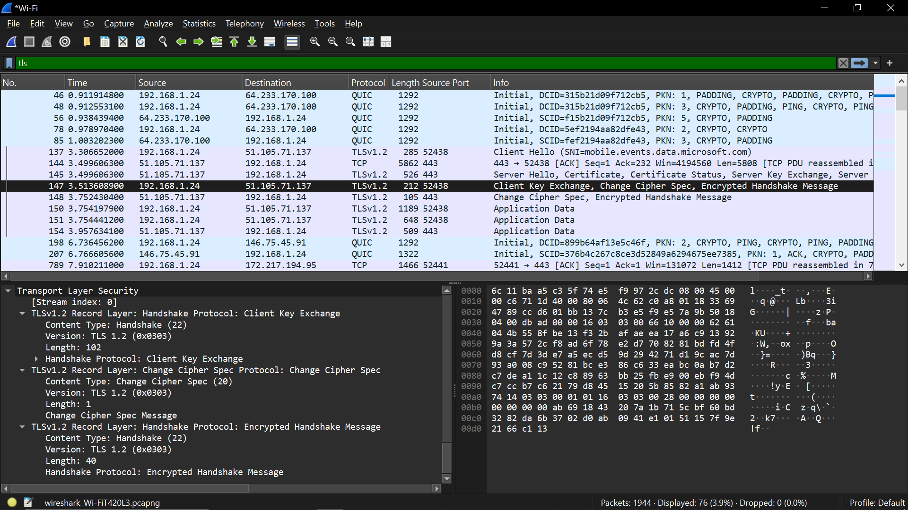

Percobaan HTTPS

Aktivitas:
Buka website misalnya

https://google.com

Filter:
tls

Data yang harus diambil:

TLS Version

Handshake Type

Cipher suite

Server Name Indication

Destination port 443

Screenshot yang harus ada:

Client Hello

Server Hello

Encrypted Application Data

Analisis yang harus ditulis:

Perbedaan dengan HTTP:

HTTP:
payload bisa dibaca

HTTPS:
payload terenkripsi

Sebutkan bahwa komunikasi menggunakan TLS handshake sebelum data dikirim.