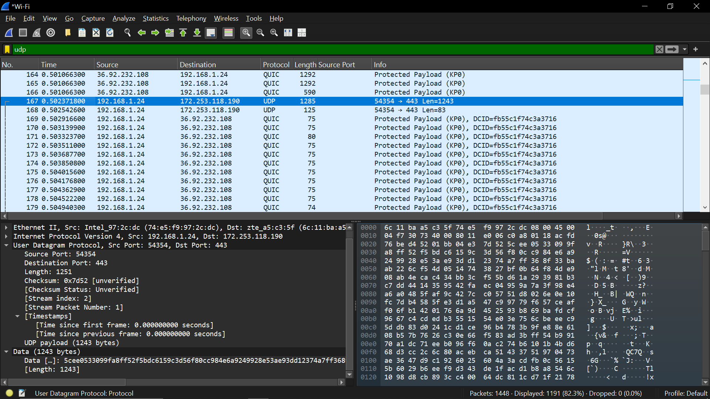

Percobaan Video Streaming

Aktivitas:
Start capture
buka YouTube
putar video 1 menit

Filter:
quic
udp

Data yang harus dicatat:

Protocol QUIC
Packet size
Stream ID
arah trafik (server ke client dominan)

Screenshot:
paket QUIC
ukuran paket besar

Analisis yang harus ditulis:
Streaming memiliki karakteristik
trafik dominan server → client
paket besar
throughput tinggi